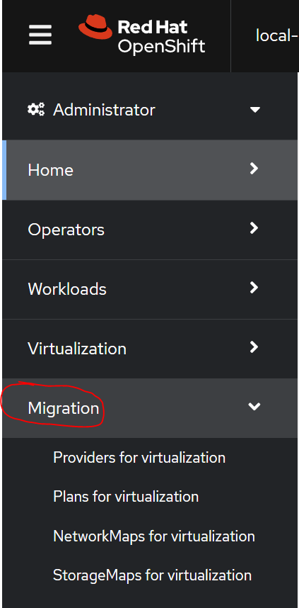

# ocp-virtualization

All usecases will be based on BM1 

## **Usecase 1: Optimize your VMs workload**

In this usecase we are going to configure HA http server on 2 VMs running in OpenShift Virtualization. 
We are going to laverage : 
 - VMs Template Catalogue
 - Cloud Init
 - Deploy the VMs from Template
 - Connect to the VM
 - Create K8S service to webserver 
 - Create route to the service LoadBalancer
 - update the runStrategy
 - create Liveness Probes 


1. Update the following files with your password and your registration key into cloud init section.
Here are the section to update : 

```
                userData: |-
                  #cloud-config
                  user: XXXX
                  password: XXXX
                  ssh_pwauth: True
                  chpasswd: { expire: False }
                  rh_subscription:
                    activation-key: xxxx
                    org: xxxx
                    auto-attach: True
                  runcmd:
                    - sudo yum install -y httpd
                    - sudo systemctl enable httpd --now
                    - sudo localectl set-keymap fr                    
                  write_files:
                    - content: |
                        Welcome to CIC demo - Server 1
                      path: /var/www/html/index.html   
              name: cloudinitdisk
```


[rhel8-template-defaultNet-webserver-1.yaml](./manifests/rhel8-template-defaultNet-webserver-1.yaml)
[rhel8-template-defaultNet-webserver-2.yaml](./manifests/rhel8-template-defaultNet-webserver-2.yaml)

Once it is done. please deploy your template - note you can update also the name if you want. 

2. Update the reStrategy with rerunOnfailure on the template.  


3. Create VMs from template, **note you shoud not run the VMs after creation.** 


4. Create the service

[service.yaml](./manifests/webserver-services.yaml)

5. Create the route 

[route.yaml](./manifests/webserver-route.yaml)

Note: the route needs to be updated based on your environement 

6. create liveness probes with the exemple available here : [liveness.yaml](./manifests/liveness-prob-example.yaml)

8. Start VMs if it is not running 

9. Connect to VM by using the virtctl cli 

```
virtctl -n nico-demo-vm ssh userd@web1
```

10. Stop the httpd service 

11.  check the vmi instances 

 

## **UseCase 2 :**

In this use case you will have the posibility to migrate VM from VMware to OpenShift by using MTV tools. 
the MTV operator is already installed. 




